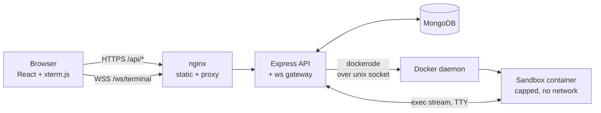
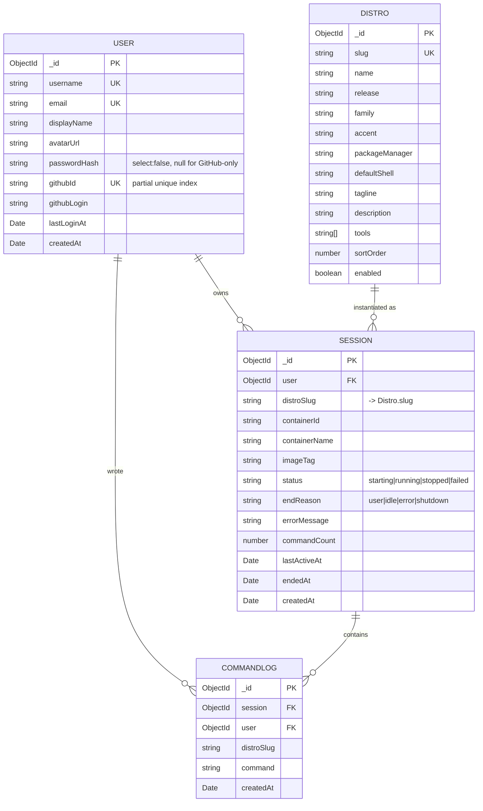

# Linux Playgrounds

Disposable Linux distro sandboxes with a real shell in the browser. Sign in, pick a
distribution, and get an isolated container you can actually break — then throw it away.

---

## What this is

Trying out a Linux distribution normally costs you an afternoon: find an ISO, provision a VM,
allocate disk, install, and remember to delete it later. Most of the time you only wanted to
answer a small question — *what does `dnf` output look like?*, *does this script work under musl?*,
*what's actually in a stock Arch base image?*

Linux Playgrounds removes the setup. Every distro in the catalog is one click away from a live
shell in your browser. The container is real: your commands hit a real kernel, files persist while
the sandbox is alive, and `cd` still means something on the next line. When you're done, the
sandbox and everything in it is deleted.

**Who it's for**

- Students meeting a second package manager for the first time
- Developers checking whether a shell script survives musl, glibc, `apt` and `pacman`
- Anyone who wants to poke at a distro without installing it

**What it deliberately is not:** a VPS, a CI runner, or a place to host anything. Sandboxes have no
network access, hard resource caps, and a short idle life.

---

## Stack

| Layer | Choice | Why |
|---|---|---|
| Frontend | React 18 + Vite, React Router, Tailwind | Fast dev loop, no framework server needed |
| Terminal | xterm.js + fit addon | Real terminal emulation, not a fake prompt |
| Transport | WebSocket (`ws`) | Streaming, interactive I/O; HTTP request/response cannot do this |
| Backend | Node 20 + Express 4 | Small API surface, same language as the frontend |
| Auth | JWT + bcrypt, GitHub OAuth | Password accounts and GitHub sign-in land on one user record |
| Database | MongoDB + Mongoose | Document shapes fit sessions and logs without migrations |
| Sandboxes | Docker via `dockerode` | One long-lived container per session, capped and unprivileged |

## Repository layout

```
.
├── docker-compose.yml          Full stack: mongo + api + nginx-served web
├── .env.example                Compose-level secrets and tuning
│
├── os_servers_backend/         API, WebSocket gateway, container orchestration
│   ├── server.js               Boot: db, docker check, http + ws, idle reaper
│   ├── app.js                  Express app, CORS, routes, error handling
│   ├── config/
│   │   ├── env.js              Validates required env vars, fails fast
│   │   └── db.js               Mongoose connection
│   ├── data/distros.js         Distro catalog, the source of truth for seeding
│   ├── models/                 User, Distro, Session, CommandLog
│   ├── routes/                 authRoutes, distroRoutes, sessionRoutes
│   ├── middleware/             requireAuth, error handler, async wrapper
│   ├── lib/
│   │   ├── docker.js           Image existence checks and builds
│   │   ├── sandbox.js          Container create/exec/resize/destroy + limits
│   │   ├── sessionService.js   Session lifecycle, quotas, reaping
│   │   ├── githubOAuth.js      Authorize URL, code exchange, profile fetch
│   │   └── tokens.js           JWT sign and verify
│   ├── ws/terminalGateway.js   WebSocket upgrade, auth, shell bridge
│   ├── dockerfiles/            One Dockerfile per distro + shared motd
│   └── scripts/                seed, buildImages, cleanupContainers
│
└── os_servers_frontend/        React SPA
    ├── nginx.conf              Static serving + /api and /ws proxying
    └── src/
        ├── api/client.js       Axios instance, token handling, socket URL
        ├── auth/               AuthProvider, useAuth
        ├── routes/             ProtectedRoute, PublicOnlyRoute
        ├── components/         AppShell, AuthShell, UI primitives
        ├── lib/terminalSocket.js
        └── pages/              Login, Register, OAuthCallback, Distros, Sessions, Terminal
```

## How the pieces connect



The important boundary: **the browser never talks to Docker.** It talks to the API, which
authenticates every HTTP request and every WebSocket upgrade, checks that the session belongs to
the caller, and only then attaches a shell to that specific container.

### Why WebSocket rather than HTTP per command

An HTTP endpoint that runs one command per request has to create a container per request, which
means `cd /tmp` and the `ls` after it happen in different machines. Session state — working
directory, environment, files, installed packages, a half-written file in `vim` — only exists if
the process stays alive between keystrokes. One container per session with a streaming exec is the
only shape that makes an actual shell work.

---

## User flow

1. **Land on `/`** — redirected to `/distros`; unauthenticated visitors go to `/login`.
2. **Sign in or register.** Email plus password, or *Continue with GitHub*. GitHub returns to
   `/auth/callback`, the token is stored, and the profile is loaded. A GitHub account whose email
   matches an existing password account links to it rather than creating a duplicate.
3. **Browse the catalog** at `/distros` — five distributions with release, family, package manager
   and preinstalled tooling.
4. **Launch a sandbox.** The API builds the image if it is missing, creates a capped container,
   records a `Session`, and routes you to `/terminal/:sessionId`.
5. **Use the shell.** xterm.js opens a WebSocket; the API attaches a TTY exec to your container.
   Typing, output, resize, colours, `vim`, pipes and job control all behave. Each command you enter
   is logged to `CommandLog`.
6. **Leave and come back.** Closing the tab detaches the shell but leaves the container running.
   Reopening the session — from `/sessions` — attaches a fresh shell to the same container, with
   your files still in place.
7. **Manage sandboxes** at `/sessions`: status, command counts, age, applied resource limits, and
   your recent command history. Attach, stop, or relaunch from here.
8. **Stop.** *Destroy sandbox* removes the container and its filesystem. Leaving it idle past the
   cutoff does the same automatically.

---

## Database schema



**Relationships**

- `Session.user` → `User._id`. A user has many sessions; deleting a user should cascade (not
  implemented — see limitations).
- `CommandLog.session` → `Session._id` and `CommandLog.user` → `User._id`. The redundant `user`
  reference makes "my recent commands" a single indexed query.
- `Session.distroSlug` → `Distro.slug`. A slug rather than an ObjectId, so a session stays readable
  even if a distro is later disabled or removed.
- `User.githubId` uses a **partial** unique index (`$type: "string"`), not a sparse one — sparse
  indexes still collide on explicit `null`, which every password-only account has.

---

## Installation

### Prerequisites

- **Node.js 20+** and npm
- **Docker**, with a daemon your user can reach (`docker ps` must work without sudo)
- **MongoDB** — local, containerised, or Atlas

### 1. Clone

```bash
git clone <your-repo-url> linux-playgrounds
cd linux-playgrounds
```

### 2. Install dependencies

```bash
cd os_servers_backend && npm install
cd ../os_servers_frontend && npm install
cd ..
```

### 3. Environment

```bash
cp os_servers_backend/.env.example os_servers_backend/.env
cp os_servers_frontend/.env.example os_servers_frontend/.env
```

Fill in `MONGO_URI` and `JWT_SECRET` at minimum. See
[Credentials checklist](#credentials-checklist) below. Generate a secret with:

```bash
node -e "console.log(require('crypto').randomBytes(48).toString('base64url'))"
```

No MongoDB handy? Start one in Docker:

```bash
docker run -d --name lp-mongo -p 27017:27017 -v lp-mongo-data:/data/db mongo:7
# then set MONGO_URI=mongodb://127.0.0.1:27017/linux_playgrounds
```

### 4. Build the sandbox images

```bash
cd os_servers_backend
npm run images:build
```

First run pulls five base images and takes roughly 10–15 minutes. Images are cached after that,
and the API will build any missing image on demand anyway. Build a subset while testing:

```bash
npm run images:build ubuntu alpine
```

### 5. Seed the database

```bash
npm run seed
```

### 6. Run

```bash
# terminal 1
cd os_servers_backend && npm run dev

# terminal 2
cd os_servers_frontend && npm run dev
```

Open **http://localhost:5173** and sign in with `ada@example.com` / `playground123`.

---

## Seed data

One script covers every model: `Distro`, `User`, `Session` and `CommandLog`.

| Command | Effect |
|---|---|
| `npm run seed` | Re-runnable. Upserts all 5 distros, deletes and recreates the 4 seed users along with their sessions and command logs. Leaves any accounts you created by hand untouched. |
| `npm run seed:reset` | **Drops the entire database**, then seeds from scratch. |

Run both from `os_servers_backend/`. Seeded accounts:

| Email | Password | Notes |
|---|---|---|
| `ada@example.com` | `playground123` | Password account |
| `rafi@example.com` | `playground123` | Also linked to a GitHub id |
| `juno@example.com` | `playground123` | Password account |
| `sable@example.com` | `playground123` | Has a failed session, for error-state UI |

Override the password with `SEED_PASSWORD=... npm run seed`.

Seeded sessions are all in a terminal state (`stopped` / `failed`) on purpose — they are history,
not live containers. Real containers only ever come from the running app.

To clear stray sandbox containers (after a crash, say):

```bash
npm run sandboxes:clean
```

---

## Credentials checklist

Fill these in yourself. Nothing here is committed, and no placeholder values ship in the repo.

### Required — the app will not start without these

- [ ] `MONGO_URI` — MongoDB connection string
      *(`mongodb://127.0.0.1:27017/linux_playgrounds` locally, or an Atlas SRV URI)*
- [ ] `JWT_SECRET` — random string, 32+ bytes. Generate it, never reuse one across environments

### Required in production

- [ ] `PUBLIC_WEB_URL` — public URL of the frontend, e.g. `https://play.example.com`.
      Used for the GitHub OAuth redirect back into the app
- [ ] `CORS_ORIGINS` — comma-separated allowed origins. Same as above for a single-domain deploy
- [ ] `NODE_ENV=production`

### Required only for GitHub sign-in

Create the app at **GitHub → Settings → Developer settings → OAuth Apps → New OAuth App**.
Set the callback URL to `https://<your-domain>/api/auth/github/callback`.

- [ ] `GITHUB_CLIENT_ID`
- [ ] `GITHUB_CLIENT_SECRET`

Leave both blank and the GitHub buttons return a clear "not configured" error; password auth keeps
working.

### Optional — tuning, all have defaults

- [ ] `PORT` (5000) · `JWT_EXPIRES_IN` (7d)
- [ ] `DOCKER_SOCKET_PATH` (`/var/run/docker.sock`)
- [ ] `SANDBOX_IMAGE_PREFIX` (`linux-playgrounds`)
- [ ] `SANDBOX_MEMORY_MB` (256) · `SANDBOX_CPUS` (0.5) · `SANDBOX_PIDS_LIMIT` (128)
- [ ] `SANDBOX_NETWORK` (`none`) — see the warning under Hosting
- [ ] `SANDBOX_IDLE_TIMEOUT_MINUTES` (20) · `SANDBOX_MAX_SESSIONS_PER_USER` (3)
- [ ] `SANDBOX_REAPER_INTERVAL_SECONDS` (60)
- [ ] `SEED_PASSWORD` — seed script only

### Frontend, build time

- [ ] `VITE_API_URL` — `http://localhost:5000` in dev. **Leave empty** for a single-domain deploy;
      the client then uses its own origin

Not needed by this project: no object storage, mail provider, payment processor or analytics keys.

---

## Hosting

The one hard requirement: **the API needs a Docker daemon.** Vercel, Netlify and other
function-based platforms cannot host it. Any VM with Docker can — a $5–10/month Hetzner,
DigitalOcean, Linode or Fly.io machine is enough. 2 GB RAM and 20 GB disk is a comfortable floor;
the five images together are about 2.3 GB, and each running sandbox takes its configured memory cap.

### Compose deploy

```bash
cp .env.example .env
node -e "console.log(require('crypto').randomBytes(48).toString('base64url'))"   # -> JWT_SECRET
$EDITOR .env

docker compose build
docker compose up -d

docker compose exec api npm run images:build
docker compose exec api npm run seed          # optional, demo accounts
```

The app is then on `http://<host>:8080`. Put a TLS terminator (Caddy, nginx, or a Cloudflare
tunnel) in front before exposing it publicly — the WebSocket must upgrade over `wss://`, and
`nginx.conf` already forwards the `Upgrade` and `Connection` headers.

Compose refuses to start without `JWT_SECRET`. That is deliberate.

### Security notes you should read before going public

- **The API container mounts `/var/run/docker.sock`.** That is equivalent to root on the host.
  It is how the API creates sandboxes. Only run trusted code in that container, and prefer a
  dedicated VM that hosts nothing else.
- **Sandboxes run with `SANDBOX_NETWORK=none` by default.** Setting it to `bridge` lets users
  `apt install`, but also lets them port-scan, spam and mine from your IP. Leave it off unless you
  are prepared for that.
- Containers already run as a non-root user with **all capabilities dropped**,
  `no-new-privileges`, a memory cap, a CPU cap, a PID cap and a read-only-ish `/tmp`.
  Verified: a fork bomb hits the PID limit and the host stays responsive.
- Sandboxes are **not a security boundary against a kernel exploit.** Containers share the host
  kernel. For untrusted users at scale you want gVisor, Kata Containers or Firecracker.

---

## Known limitations / out of scope

Deliberately not in the MVP:

- **Password reset.** No mail provider is wired up. The page and route were removed rather than
  left as dead UI. Adding it means a reset-token model plus SMTP or Resend credentials.
- **Persistent volumes.** Stopping a sandbox deletes its filesystem. There is no way to save work,
  and no file upload or download.
- **No network inside sandboxes** by default, so `apt install` / `pip install` will not work.
  Tooling is baked into the images instead.
- **Teams, sharing and collaboration.** Sessions are private to one user.
- **Billing, quotas beyond a session count, and rate limiting.** There is no per-IP throttle on
  registration or login.
- **Account management.** No profile editing, no password change, no account deletion, and no
  cascade — deleting a user leaves orphaned sessions and logs behind.
- **Automated tests.** Verification so far is manual and end-to-end.
- **Horizontal scaling.** Sessions are pinned to the Docker daemon that created them, so more than
  one API instance needs sticky routing or a scheduler.
- **Distro coverage.** Five: Ubuntu, Debian, Alpine, Fedora, Arch. Mint, Pop!\_OS and Parrot were
  dropped because they publish no usable official base image; Kali was dropped because a
  Metasploit-bearing image is multi-gigabyte.
- **Terminal features.** Copy/paste uses the browser's native handling; there are no tabs, splits,
  or session sharing.

## Scripts

**Backend** (`os_servers_backend/`)

| Command | Description |
|---|---|
| `npm run dev` | Start the API with file watching |
| `npm start` | Start the API |
| `npm run seed` | Seed the database, re-runnable |
| `npm run seed:reset` | Drop the database and seed |
| `npm run images:build` | Build missing sandbox images |
| `npm run images:rebuild` | Rebuild all sandbox images |
| `npm run sandboxes:clean` | Force-remove every managed sandbox container |

**Frontend** (`os_servers_frontend/`)

| Command | Description |
|---|---|
| `npm run dev` | Vite dev server on :5173 |
| `npm run build` | Production build to `dist/` |
| `npm run preview` | Serve the production build on :4173 |
| `npm run lint` | ESLint, zero warnings tolerated |

## API reference

| Method | Route | Auth | Purpose |
|---|---|---|---|
| `GET` | `/api/health` | — | Status, Docker reachability, whether OAuth is configured |
| `POST` | `/api/auth/register` | — | Create an account, returns a JWT |
| `POST` | `/api/auth/login` | — | Sign in, returns a JWT |
| `GET` | `/api/auth/me` | JWT | Current profile |
| `GET` | `/api/auth/github` | — | Redirect into the GitHub OAuth flow |
| `GET` | `/api/auth/github/callback` | — | Code exchange, redirects to the web app with a token |
| `GET` | `/api/distros` | — | Enabled distro catalog |
| `GET` | `/api/distros/:slug` | — | One distro |
| `GET` | `/api/sessions` | JWT | Your sessions plus the applied sandbox limits |
| `POST` | `/api/sessions` | JWT | Start or resume a sandbox |
| `GET` | `/api/sessions/history` | JWT | Your 20 most recent commands |
| `GET` | `/api/sessions/:id` | JWT | One session you own |
| `DELETE` | `/api/sessions/:id` | JWT | Destroy the sandbox |
| `WS` | `/ws/terminal?session=&token=` | JWT | Attach a shell |

WebSocket messages — client sends `{type:"input",data}` and `{type:"resize",cols,rows}`; server
sends `{type:"ready"}`, `{type:"output",data}`, `{type:"exit",reason}` and `{type:"error",message}`.
